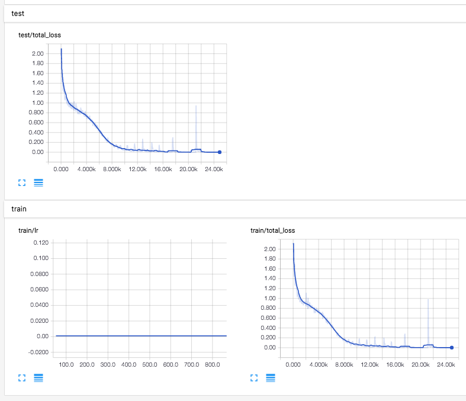
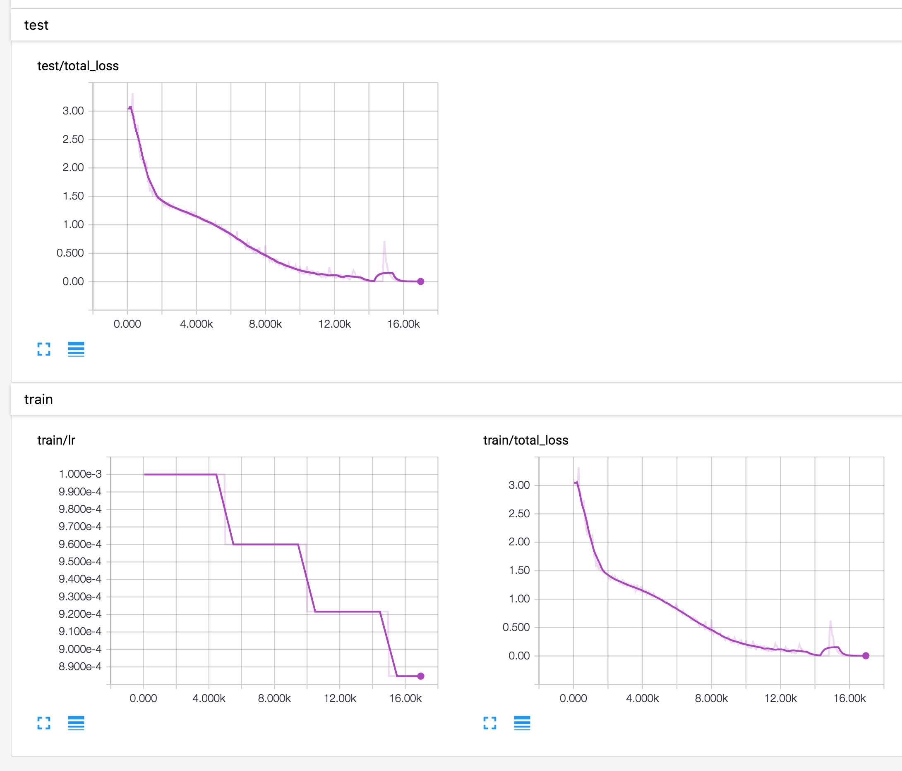

# Pointer Networks in Tensorflow

TensorFlow implementation of [Pointer Networks](https://arxiv.org/abs/1506.03134).

*Support multithreaded data pipelines to reduce I/O latency.*

## Requirements

- Python 2.7
- [requests](http://python-requests.org/)
- [tqdm](https://github.com/tqdm/tqdm)
- [TensorFlow 0.12.1](https://github.com/tensorflow/tensorflow/tree/r0.12)

## Usage

To train a model:

    $ python main.py --task=tsp --max_data_length=20 --hidden_dim=512 # download dataset used in the paper
    $ python main.py --task=tsp --max_data_length=10 --hidden_dim=128 # generate dataset itself

To train a model:

    $ python main.py
    $ tensorboard --logdir=logs --host=0.0.0.0

To test a model:

    $ python main.py --is_train=False

## Results

Train/Test loss of `max_data_length=10` after 24,000 steps:

    $ python main.py --task=tsp --max_data_length=10 --hidden_dim=128
    $ ...
    $ 2017-01-18 17:17:48,054:INFO::
    $ 2017-01-18 17:17:48,054:INFO::test loss: 0.00149279157631
    $ 2017-01-18 17:17:48,055:INFO::test pred: [1 6 2 5 4 3 0 0 0 0 0]
    $ 2017-01-18 17:17:48,057:INFO::test true: [1 6 2 5 4 3 0 0 0 0 0] (True)
    $ 2017-01-18 17:17:48,059:INFO::test pred: [1 3 8 4 7 5 2 6 0 0 0]
    $ 2017-01-18 17:17:48,059:INFO::test true: [1 3 8 4 7 5 2 6 0 0 0] (True)
    $ 2017-01-18 17:17:48,058:INFO::test pred: [ 1  8  3  7  9  5  6  4  2 10  0]
    $ 2017-01-18 17:17:48,058:INFO::test true: [ 1  8  3  7  9  5  6  4  2 10  0] (True)

Train/Test loss of `max_data_length=20` after 16,000 steps:

    $ python main.py --task=tsp --max_data_length=20 --hidden_dim=512
    $ ...
    $ 2017-01-18 17:30:44,738:INFO::
    $ 2017-01-18 17:30:44,739:INFO::test loss: 0.0501566007733
    $ 2017-01-18 17:30:44,739:INFO::test pred: [ 1  3 16 18  6  2  7  4  5 15 10  8 13 11 17 20 19 14  9 12  0]
    $ 2017-01-18 17:30:44,740:INFO::test true: [ 1  3 16 18  6  2  7  4  5 15 10  8 13 11 17 20 19 14  9 12  0] (True)
    $ 2017-01-18 17:30:44,741:INFO::test pred: [ 1  4 12  8  2 17 20  3 18 14 16 11 13 15  7 10  9  6 19  5  0]
    $ 2017-01-18 17:30:44,741:INFO::test true: [ 1  4 12  8  2 17 20  3 18 14 16 11 13 15  7 10  9  6 19  5  0] (True)
    $ 2017-01-18 17:30:44,742:INFO::test pred: [ 1  8 16 20 19 14 18  2  9 12 15 11  3 13  5  6  7  4 17 10  0]
    $ 2017-01-18 17:30:44,742:INFO::test true: [ 1  8 16 20 19 14 18  2  9 12 15 11  3 13  5  6  7  4 17 10  0] (True)

## Author

Taehoon Kim / [@carpedm20](http://carpedm20.github.io)
